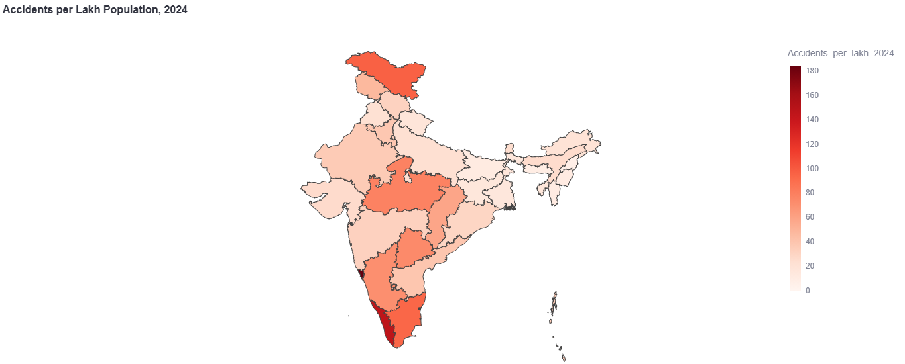
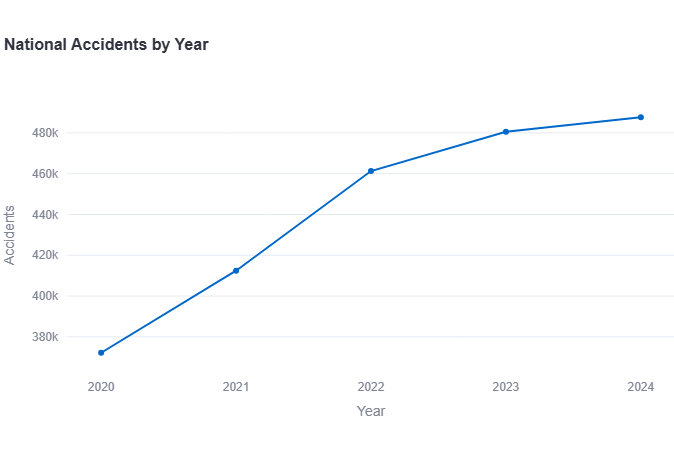
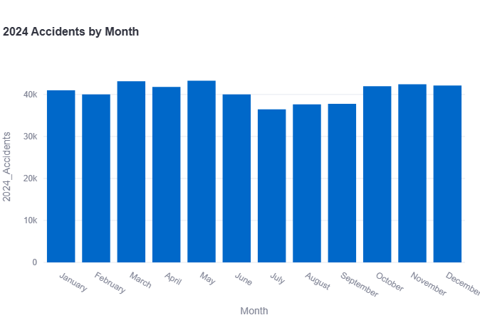
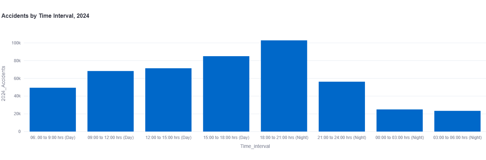
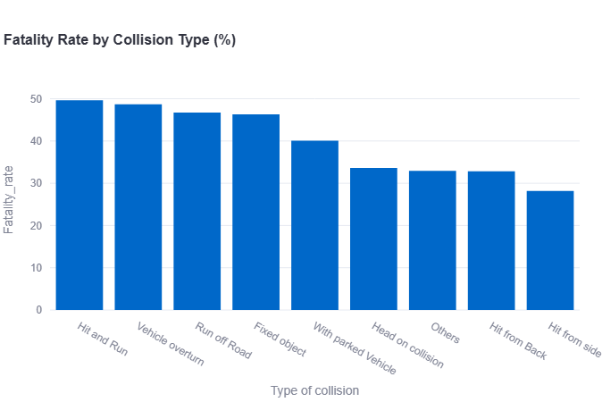
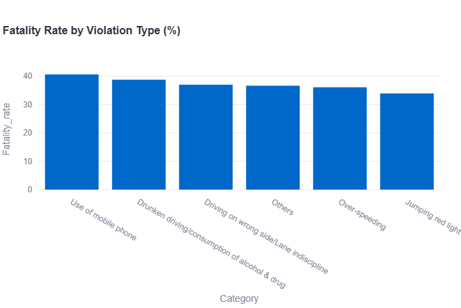
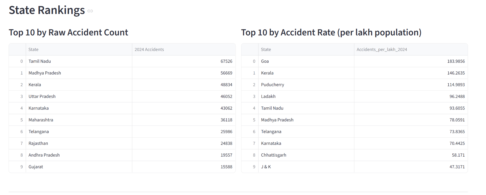

# Road Accident Analysis in India (2020-2024)

Data analytics project analyzing road accident patterns across Indian states, using MoRTH's official accident data from 2020 to 2024.

Live dashboard: https://road-accident-analysis-india-zmfhzyst4cfsyphsyqt8ed.streamlit.app/

## Dashboard

**State-wise accident rate (per lakh population)**

Goa has the highest rate despite a small raw count, standing out clearly against larger states like Maharashtra.

**National trend by year**

Accidents and fatalities have risen every year from 2020 to 2024, with no plateau yet.

**Monthly pattern, 2024**

**Time of day pattern**

18:00-21:00 is consistently the peak window across all five years.

**Severity by collision type**

**Severity by violation type**

Use of mobile phone has the highest fatality rate despite being the least frequent violation category.

**State rankings**

## Overview

This project looks at state-wise road accident rates, time-of-day and monthly patterns, and severity by collision and violation type, using data from the Ministry of Road Transport & Highways (MoRTH). It also includes a regression/classification attempt to predict state-level accident rates, which did not perform well - noted below as a real finding rather than a hidden limitation.

## Data Sources

- MoRTH "Road Accidents in India 2024" report, via cleaned CSVs from OpenCity (data.opencity.in): state-wise accidents and fatalities, type of collision, type of violation, vehicle registrations and road density, city-level accidents and fatalities, victims by causing vehicle.
- MoRTH 2024 PDF report, tables extracted directly with camelot: month-wise accident/fatality trend (Table 7.2) and time-of-day distribution (Table 7.3). These weren't available as clean CSVs from OpenCity.
- Census 2011 state/UT population figures, used as the denominator for accident rates. This is the most recent full census available, since the 2021 census was postponed. Four entries (Telangana, Jammu & Kashmir/Ladakh, and the Dadra & Nagar Haveli/Daman & Diu merger) required estimation since state boundaries have changed since 2011; each is noted in the data cleaning notebook.
- State boundary GeoJSON for the choropleth map, from a public GitHub Gist (commonly used for India state-level plotly maps).

## Methodology

1. Data cleaning: downloaded raw CSVs, fixed encoding issues (BOM characters), converted comma-formatted numbers, removed footnote/summary rows, standardized state names across tables (spelling and abbreviation differences between sources).
2. Exploratory analysis: national trend over time, time-of-day and monthly patterns, fatality rate by collision and violation type, chi-square test (collision type vs. fatal outcome) and t-test (high vs. low accident-rate states).
3. Geospatial mapping: state-level choropleth of accidents per lakh population.
4. Modeling: linear regression and random forest classification, predicting accident rate and risk tier from population, state fatality rate, and year-over-year growth.
5. Dashboard: built with Streamlit, deployed via Streamlit Community Cloud.

## Key Findings

- Goa has the highest accident rate per capita (about 184 per lakh population) despite a low raw accident count, nearly 5 times Maharashtra's rate despite Maharashtra having 35 times Goa's population.
- The 18:00-21:00 time window has been the peak accident period every year from 2020 to 2024, and its share of total accidents has slowly risen (19.9% to 21.1%).
- April 2020 shows a sharp drop in accidents nationally, consistent with India's COVID-19 lockdown period.
- Hit and Run has the highest fatality rate among collision types (about 50%), despite single-vehicle vs. multi-vehicle collisions generally showing different severity patterns.
- Use of mobile phone is the least frequent violation category but has the highest fatality rate (about 41%), higher than drunk driving or over-speeding.
- Two-wheeler riders and pedestrians bear a disproportionate share of fatalities as victims, more than car occupants, based on the victim-vs-causing-vehicle breakdown.
- Population, state fatality rate, and year-over-year growth do not meaningfully predict a state's accident rate. Regression produced a negative R², and classification accuracy varied widely across cross-validation folds. This suggests state-to-state variation depends on factors not available at state level in this dataset, such as road-type composition and enforcement intensity.

## Limitations

- State-wise data by road type (national highway vs. state highway vs. other roads) was not available through free sources. The MoRTH PDF only lists this for the top 10 states, and other sources (data.gov.in, dataful.in) were either stale/broken or required a paid account. This is flagged as a direction for future work rather than included in the current analysis.
- Population denominator is from Census 2011, not current population, since no more recent full census exists.
- Time-of-day and monthly data are national-level only; state-level breakdowns exist in MoRTH's Annexure-42 but were not extracted for this project.
- Sample size for modeling is small (36 states/UTs), which limits how much can be concluded from the regression and classification results.

